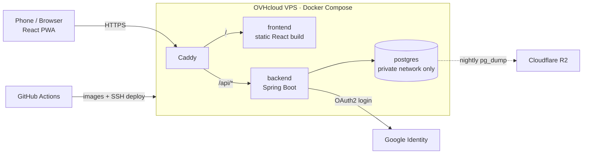

# Architecture

Living document. Constraint: total running cost ≤ €6/month; free plans everywhere else.

## 1. Tech stack

| Layer | Choice | ADR |
|---|---|---|
| Language | Java 25 (LTS) | 0009 |
| Backend | Spring Boot 4.x + Spring Modulith; Gradle (Kotlin DSL) | 0014 |
| Concurrency | Spring MVC on virtual threads; `RestClient` for outgoing HTTP | 0034 |
| Persistence | Spring Data JPA; native SQL where needed | 0028 |
| Database | PostgreSQL in Docker on the VPS; Flyway migrations | 0019, 0037 |
| Auth | Google sign-in (Spring Security OAuth2), email allowlist; sessions in Postgres (Spring Session JDBC) | 0015, 0017 |
| API | REST under `/api/v1`, OpenAPI via springdoc, Problem Details (RFC 9457), page-based pagination, Java records as DTOs | 0030, 0033 |
| Frontend | React + TypeScript + Vite, TanStack Query, React Router, Tailwind CSS, React Hook Form + Zod, vite-plugin-pwa, react-markdown; English UI, translation-ready | 0031, 0032 |
| Hosting | One OVHcloud VPS-1 (2 vCores, 4 GB RAM) running Docker Compose | 0019 |
| Reverse proxy | Caddy (automatic HTTPS), single origin | 0020 |
| Domain & DNS | Cloudflare Registrar and DNS | 0020 |
| Backups | Nightly `pg_dump` to Cloudflare R2 (EU), 14-day lifecycle | 0036 |
| Code, tasks, CI/CD | Public GitHub repo, GitHub Issues + Projects, GitHub Actions | 0021, 0024 |
| Time | UTC `timestamptz`; per-user time zone for "today" | 0029 |

## 2. System overview



## 3. Deployment shape

- **One server, separate deployments.** Frontend and backend are separate containers and images, deployable independently.
- **One origin.** Caddy serves the React app at `/` and forwards `/api/*` to the backend. No CORS; the login cookie is first-party everywhere, including Safari.
- **Postgres** runs on a private Docker network and is never exposed to the internet.
- **Portability.** Moving hosts = copy the Compose setup, restore a dump, repoint DNS.

## 4. Authentication flow

1. The SPA calls the API; without a session it gets **401** and navigates to `/api/oauth2/authorization/google`.
2. Google signs the user in and redirects to `/api/login/oauth2/code/google`. Spring Security checks the email against `quode.security.allowed-emails`; anyone else gets 403.
3. On first login the seeded `app_user` row is linked to the Google account (`sub`).
4. Session cookie: HttpOnly, Secure, SameSite=Lax, stored in Postgres (Spring Session JDBC). CSRF via a cookie token the SPA sends back in a header.

Google OAuth clients: **Quode local** (redirects to `localhost:5173` and `localhost:8080` under `/api/login/oauth2/code/google`) and **Quode production** (the domain). The production secret exists only on the server.

## 5. Repository structure

```
quode/
├── CLAUDE.md, AGENTS.md
├── docs/            architecture, domain, spaced-repetition, conventions, adr/, specs/, runbooks/
├── backend/         build.gradle.kts, src/main/java/com/quode/{shared,user,taxonomy,question,quiz,study,review}
├── frontend/        src/{api,features,components,routes}
├── deploy/          compose.yml, Caddyfile, backup/
├── compose.dev.yml  local stack
├── .claude/         settings, agents, skills
└── .github/         workflows, templates
```

## 6. Backend modules

Each module is a top-level package. Its root package holds the public API (services, DTOs, events); implementation lives in `internal`. Spring Modulith verifies the rules in a test.

| Module | Owns | Depends on |
|---|---|---|
| `user` | app_user, login linking | — |
| `taxonomy` | topic tree, descendant queries | user |
| `question` | question, answer_option, question_topic | taxonomy, user |
| `quiz` | quiz, quiz_question, filter evaluation | question |
| `study` | study_session, attempt, grading | quiz, question, review (queue only) |
| `review` | review_state, scheduler, daily queue | question; listens to `AttemptRecorded` |

`study` publishes `AttemptRecorded`; `review` applies the asymmetric quiz rule (ADR-0012). Modulith's event publication registry keeps the event if the listener fails.

## 7. Server baseline

- Non-root deploy user; SSH keys only; root and password login disabled.
- Firewall: only 22, 80, 443. Automatic security updates; fail2ban.
- Compose services restart automatically; health via `/api/actuator/health`.
- Secrets only in the server's `.env` and GitHub Actions secrets.
- JVM memory capped (e.g. `-Xmx768m`) so backend, Postgres and Caddy share 4 GB.

## 8. Backups & recovery

- Nightly compressed `pg_dump` to Cloudflare R2 (EU jurisdiction) with a bucket-scoped token; lifecycle deletes objects after 14 days.
- The script refuses dumps over 500 MB and alerts instead (free-tier guard).
- Monthly: copy the latest dump to the laptop (a copy outside Cloudflare).
- OVH's daily VPS backup is a second layer only.
- Restore test in M0 and after every Postgres upgrade. Target: a lost server is rebuilt in under one hour.

## 9. CI/CD

- **Pull request:** backend build + unit, Modulith and Testcontainers tests; frontend lint, type-check, tests, build; gitleaks; PR-title check.
- **Merge to main:** build both images, tag with the git commit, push to GitHub Container Registry, SSH into the VPS, `docker compose pull && docker compose up -d`, then a health check.
- Flyway runs on backend startup.

## 10. Testing strategy

- **Unit:** domain logic and the scheduler (pure Java, injected `Clock`).
- **Architecture:** Spring Modulith `verify()`.
- **Integration:** Testcontainers Postgres for repositories, migrations and recursive topic queries.
- **Web:** controller slice tests including security rules.
- **Frontend:** Vitest + Testing Library; Playwright end-to-end from M4.

## 11. Cost

| Item | Monthly (incl. 21% VAT) |
|---|---|
| OVHcloud VPS-1 | ≈ €4.60 |
| Domain | ≈ €0.90 |
| GitHub, Cloudflare DNS + R2, Google sign-in, UptimeRobot, healthchecks.io | €0 (free plans) |
| **Total** | **≈ €5.50** |

R2 is the only usage-billed service; a Cloudflare budget alert at $1 warns early.

## 12. Deferred decisions

Revisit only when the trigger happens: server-side caching (measured slowness), message broker (Phase 2 AI jobs), rate limiting (Phase 3 sign-up), full-text search (Library search too limited), feature flags / CDN / scaling (Phase 3).
