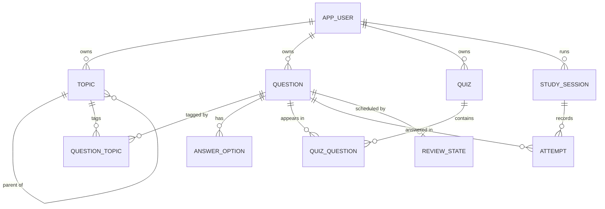

# Domain model & taxonomy

Living document. Exact columns live in the Liquibase changelog; this file holds concepts and rules.

## 1. Taxonomy

**Problem:** topics mix languages (Java), tools (Gradle), concepts (OOP), domains (Networking) and sub-topics (Java Collections), and many questions belong to more than one area.

**Decision (ADR-0003): topic tree + many-to-many tagging**

- One controlled vocabulary of topics arranged as a tree (each topic has at most one parent), stored as an adjacency list (`parent_id`).
- A question links to one or more topics; exactly one is primary (for display).
- Querying a topic includes its descendants (PostgreSQL recursive CTE).
- Difficulty is a column (1–3), not a tag. No separate tags table.

Rejected: strict hierarchy only (one-home paralysis), free tags only (duplicates, no "all of Java"), fixed axes such as seniority and role (too much work per question; backlog).

### Seed topic tree

- Languages › Java › Collections, Concurrency, JVM & Memory, Streams & Lambdas
- Frameworks › Spring › Spring Boot, Spring Security, Spring Data JPA
- Build Tools › Gradle, Maven
- Fundamentals › OOP & Design Patterns, Data Structures, Algorithms
- Web › HTTP & REST, HTML & CSS, Auth › JWT, OAuth2 / OIDC
- Databases › SQL, PostgreSQL, Indexing & Transactions
- Networking › TCP/IP, DNS
- Cloud › GCP › Cloud Run, Cloud SQL, Pub/Sub, IAM

## 2. Entities

| Entity | Purpose | Key fields |
|---|---|---|
| `app_user` | Owner of everything; one seeded row in Phase 1 | id, email, display_name, google_sub, time_zone (default Europe/Bucharest), created_at |
| `topic` | Node in the topic tree | id, owner_id, parent_id, name, slug |
| `question` | A unit of knowledge | id, owner_id, type, prompt_md, answer_md, explanation_md, difficulty, status, source_url, flagged_at, learn_next, created_at, updated_at, archived_at |
| `answer_option` | Choices for choice questions | id, question_id, text_md, is_correct, position |
| `question_topic` | Many-to-many link | question_id, topic_id, is_primary |
| `quiz` | Fixed list or saved filter | id, owner_id, name, description, kind (FIXED / DYNAMIC), filter_json, created_at |
| `quiz_question` | Questions in a fixed quiz | quiz_id, question_id, position |
| `study_session` | One run of a review or quiz | id, owner_id, kind (REVIEW / QUIZ / ADHOC), quiz_id, question_order, current_index, started_at, finished_at |
| `attempt` | One answer to one question | id, session_id, question_id, outcome (CORRECT / PARTIAL / WRONG), given_answer, graded_by (SELF / AUTO / AI), answered_at |
| `review_state` | Spaced-repetition schedule per user + question | owner_id, question_id, due_at, interval_days, ease, reps, lapses, last_reviewed_at |

Question types: `FLASHCARD` (self-graded), `SINGLE_CHOICE` (auto), `MULTIPLE_CHOICE` (auto, all-or-nothing), `OPEN_TEXT` (self-graded; AI in Phase 2). Status: `DRAFT` or `ACTIVE`.

## 3. Relationships

## 4. Business rules

1. Every question has at least one topic and exactly one primary topic.
2. `SINGLE_CHOICE`: exactly one correct option. `MULTIPLE_CHOICE`: at least two options, at least one correct.
3. Archived and draft questions never appear in reviews or quizzes.
4. A question with attempts is never hard-deleted; it is archived.
5. Review attempts always update `review_state`. Quiz attempts update it on Missed/Partial, or on Got it only when the question is due.
6. `review_state` is keyed by user + question, independent of ownership, so users can study questions they don't own without importing them.
7. A question enters daily review only if it has a `review_state`. Own questions get one on creation (unless opted out); others only when explicitly added.
8. A study session snapshots its question order; editing a quiz doesn't change a session in progress.
9. A topic can't be its own ancestor.
10. Deleting a topic is blocked while questions or child topics reference it.
11. "Flag for fixing" sets `flagged_at`; flagged questions appear under the Library's Flagged filter.

## 5. Conventions

- UUID primary keys everywhere; `owner_id NOT NULL` on owned tables (ADR-0006).
- Enum-like columns as `varchar` + check constraint (ADR-0008).
- Timestamps `timestamptz` in UTC, set by the database (ADR-0029).
- Text content stored as Markdown.

## 6. Glossary

| Term | Meaning |
|---|---|
| Question | A prompt with answer, explanation, type, difficulty and topics |
| Topic | A node in the topic tree; also acts as a tag |
| Quiz | A saved fixed list of questions or a saved filter |
| Study session | One run through a review queue or a quiz; resumable |
| Attempt | One graded answer to one question |
| Review state | When a question is next due and how well it's known |
| Due | A question whose `due_at` is today or earlier, in the user's time zone |
